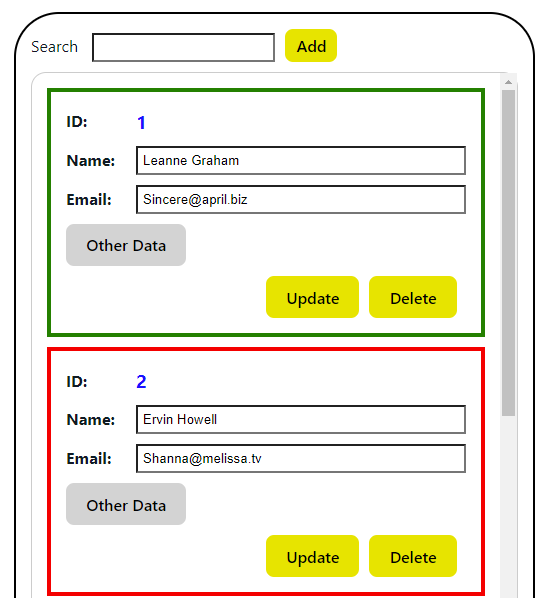
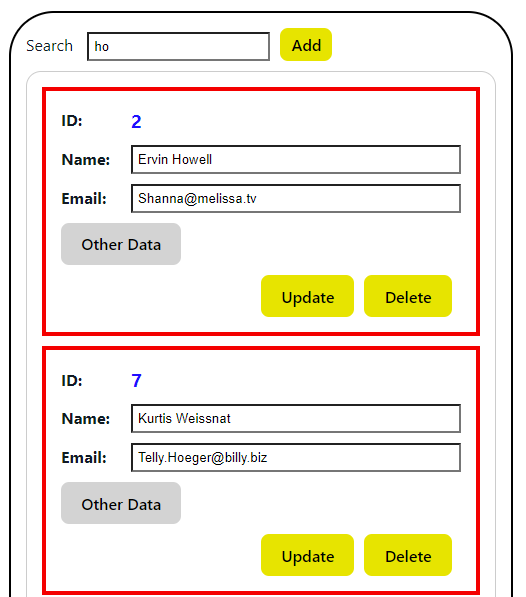
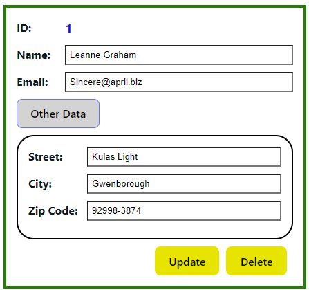
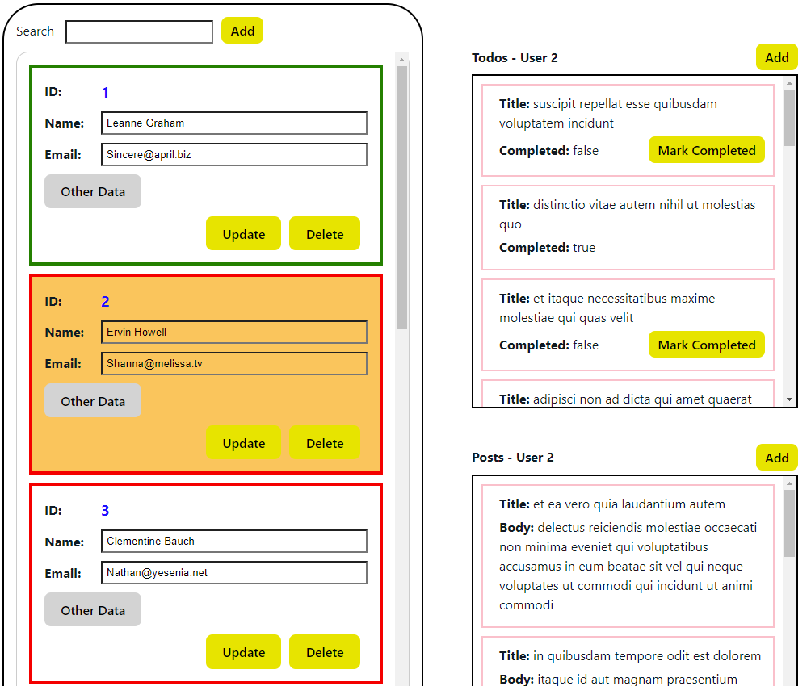
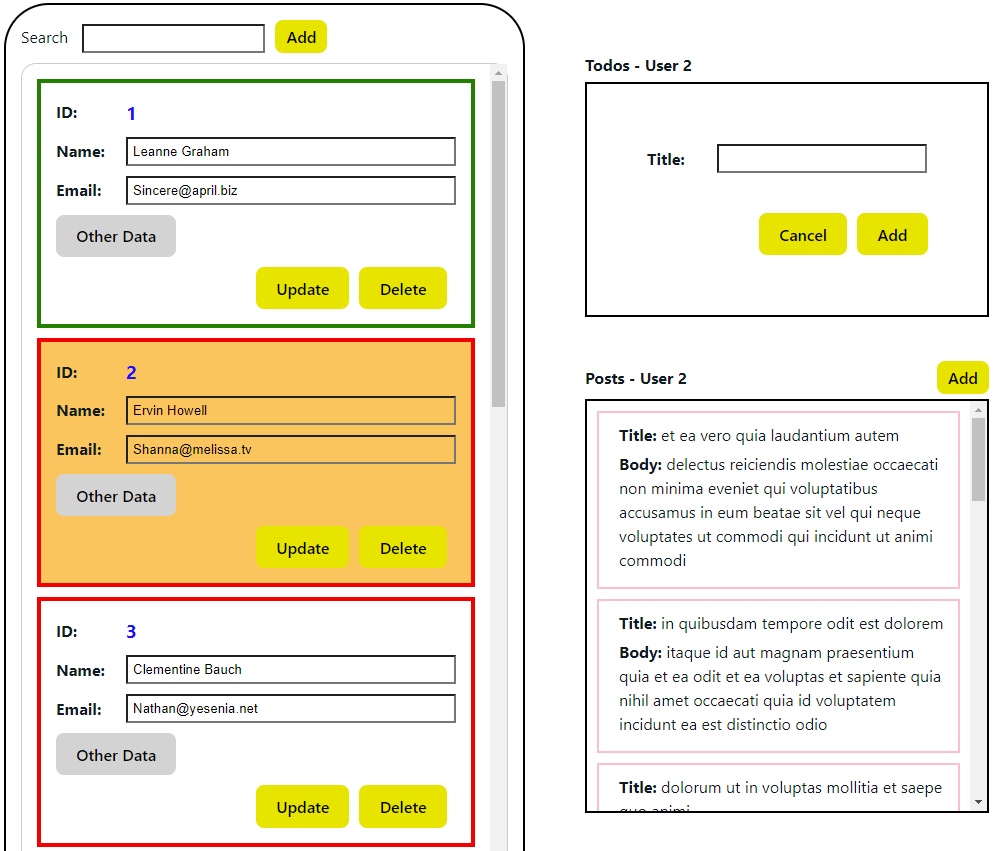
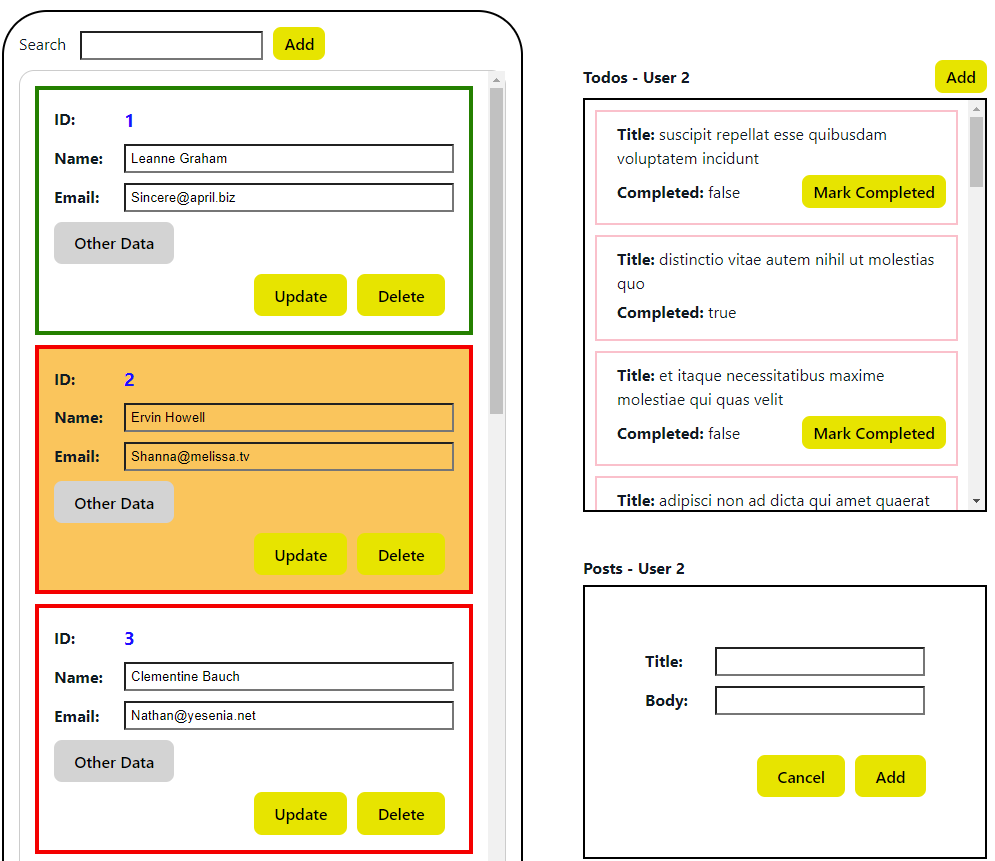
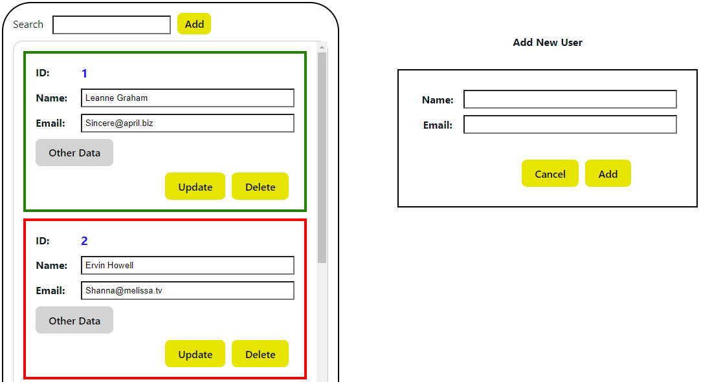

# React Project 1

This project is based on data from JSONplaceholder.

The idea is to handle a "Data Base" only on the client side, initialized by the API of [JSONplaceholder](https://jsonplaceholder.typicode.com/).

## Main Functionallity
1. **Presenting Users:** the UI presents all the users data, according to the users id. Users with UNCOMPLETED tasks (todos) are marked with a red border. Users with all tasks completed – with green border.

2. **Search Filter:** when entering a text in the “search” text box, the users list presents anly users that their name or
email contains that text.

3. **Other Data:** each user has "Other Data" section. When “Mouse over” this section, more user info is presented.

4. **Update/Delete operations for every user.**

5. **Todos-Posts Section:** when clicking on the ID label, the user region will be colored in orange and the user’s posts and todos
are presented to the right.

6. **Add New Todo:** when press on “Add” above the Todo list, the list is replaced with a place for adding a new Todo. A press on “cancel” brings back the Todo list.

7. **Add New Post:** when press on “Add” above the Post list, the list is replaced with a place for adding a new post. A press on “cancel” brings back the Post list.

8. **Add New User:** when press on “Add” above the Users list, The right side will be navigated to a new user “screen”.
The “other data” appears blank in creation but can be updatded only on update user’s data.

